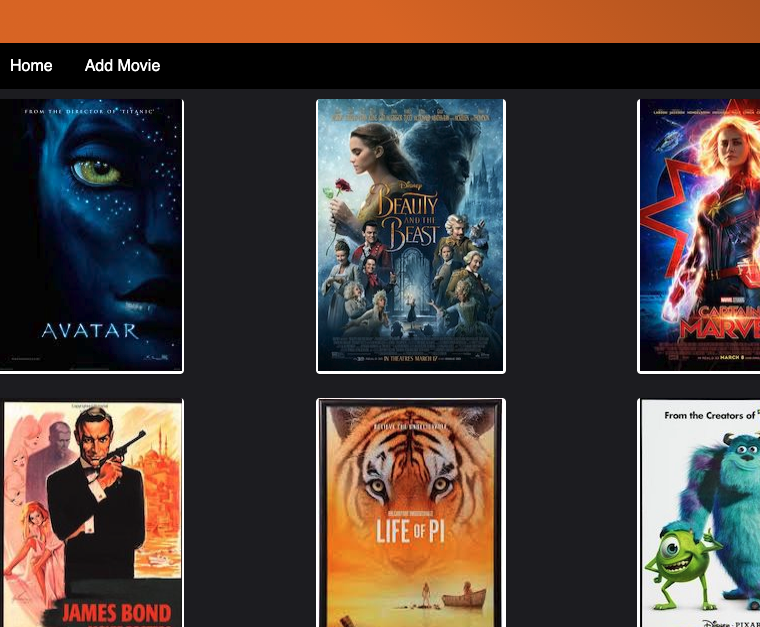
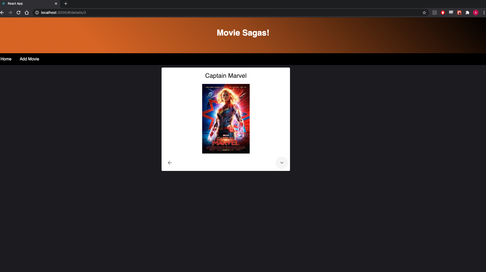
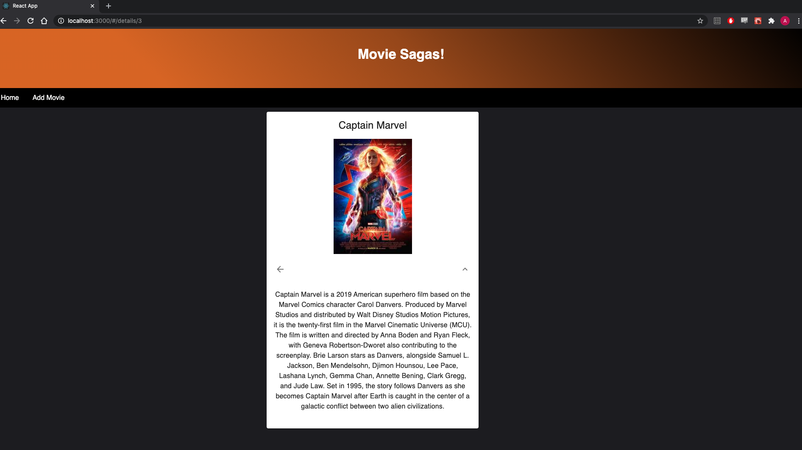
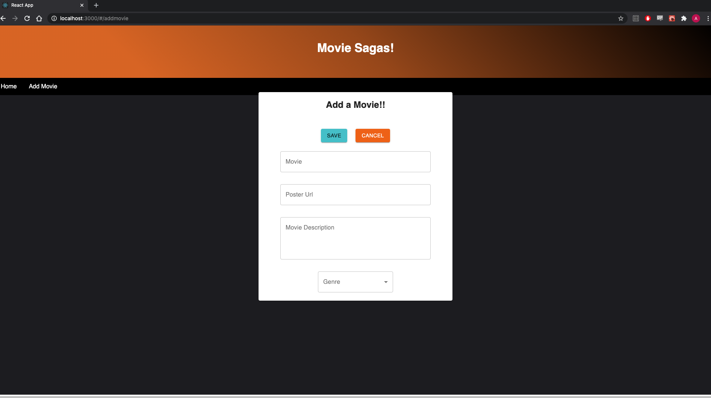

# Movie Sagas


## Description

This was a project to show a list of movies that you can click on and see their details.  The big challenge for me in this project was getting it styled in a interesting way, and there is a lot more for me to learn with Material-ui.  I would like to have got more stretch goals done but I will be working on those after this is done.

## ON START UP

```
npm install
```
-After everything is installed grab the information out of the database.sql and set up your own database with the name 'saga_movies_weekend'.
after getting tables set up you should be ready to ```npm run server``` and then ``` npm run client``` to get the app running.

-From the home screen you can see the movies currently in the database.

-Click on a movie to navigate to that movies specific details page.  --*NOTE I would like to have shown all of the genres here but I did not get there in time.*

-You can see the movie details by clicking on the down arrow chevron symbol, and you can navigate back to home either through the nav bar, or the back arrow button.

-If you go to the *Add Movie* page you can enter A movie title, a url location for its poster, a description, and one genre at the moment. (I recomend using wikipedia for your source unless you have specific info to add.)

-Clicking Save or hitting ENTER will submit the new movie to the database and bring you back to the movie list where you will see the new movie on the DOM!

### ScreenShots





### Built on 
```
express library
node.js
react.js
postgreSQL
material-ui for themeing
redux
```

## Thanks
I would like to thank my instructors for giving me the knowledge and knowhow to build this and other future apps, and to my cohort mates that help as much as they do. Cheers!